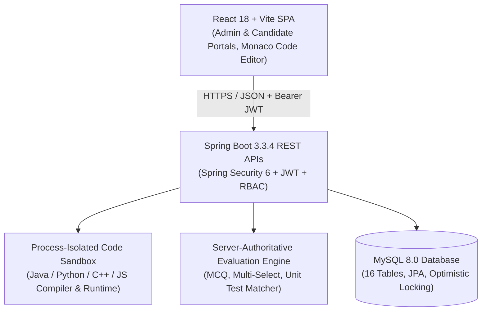

# Corporate Technical Recruitment Examination Platform

> **A Production-Grade, Enterprise Online Assessment & Examination System** engineered for corporate talent acquisition, campus recruitment drives, and employee benchmarking.

---

## 📑 Architecture Overview

The system is built as a multi-tier, enterprise-grade architecture:



---

## 🚀 Key Features

### 1. Robust Security & Authentication
* **Role-Based Access Control (RBAC):** Strict segregation between `ROLE_ADMIN` and `ROLE_CANDIDATE`.
* **Stateless JWT Authentication:** HMAC-SHA512 signed tokens with automated verification and expiry handling.
* **Audit Trail:** Immutable logging of all administrative actions, candidate authentications, and assessment submissions.

### 2. Comprehensive Examination & Question Bank Engine
* **Multiple Question Types:**
  * Single-Choice MCQs (with optional negative marking).
  * Multiple-Answer Select (all correct options required).
  * Coding Challenges with hidden & public test cases, constraints, and starter boilerplate code.
* **Flexible Assessment Rules:** Configurable duration, passing marks, randomized question ordering, and attempt caps.

### 3. Process-Isolated Code Execution Sandbox
* **Multi-Language Support:** Java 21, Python 3, C++, and JavaScript (Node.js).
* **Security & Sandboxing:**
  * Code Sanitizer blocking unsafe operations (`System.exit`, `ProcessBuilder`, `Runtime.exec`, malicious file/socket access).
  * Subprocess timeouts and memory limit enforcement.
  * Standard I/O test case feeding with output diff checking.

### 4. Server-Authoritative Timer & Anti-Cheat Proctoring
* **Authoritative Timer:** Remaining time is tracked on the server (`expectedEndTime`). Local clock tampering has zero effect.
* **Proctoring Telemetry:**
  * Fullscreen exit detection.
  * Tab/window switching detection (`visibilitychange` and `blur` events).
  * Copy/paste prevention.
  * DevTools access prevention.
  * Strike violation accumulator with optional automatic auto-submission.
* **Background Sweeper:** `@Scheduled` background worker automatically sweeps and finalizes expired attempts every 30 seconds.

### 5. Automated Evaluation & Strict Candidate Confidentiality
* **Instant Server-Side Evaluation:** Evaluates MCQs, Multiple-Answers, and Coding challenges upon submission.
* **Confidentiality Enforcement:** Candidates receive only a generic submission acknowledgment (`"Assessment submitted successfully"`). Scores, percentage pass/fail status, and answer keys are strictly withheld from candidate-facing endpoints and stored securely for Admin review.
* **Admin Results & Proctoring Dashboard:** Real-time analytics, pass rate aggregations, per-question score breakdown, submitted code viewer, and violation logs.

---

## 🛠️ Technology Stack

| Layer | Technology |
| :--- | :--- |
| **Frontend** | React 18, Vite, React Router 6, Axios, Monaco Code Editor (`@monaco-editor/react`), Lucide React, Custom CSS Design System |
| **Backend** | Java 21, Spring Boot 3.3.4, Spring Security 6, Spring Data JPA, Hibernate ORM, Bean Validation |
| **Database** | MySQL 8.0 (`recruitment_db`) |
| **Build Tools** | Maven 3.9+, npm / Vite |

---

## 🔑 Default Credentials & Roles

| Role | Username | Password | Notes |
| :--- | :--- | :--- | :--- |
| **Admin** | `admin` | `Admin@123` | Full access to create exams, questions, view results & proctoring logs |
| **Candidate 1** | `john.doe` | `Candidate@123` | Candidate ID: `CAND-2026-001` |
| **Candidate 2** | `alice.smith` | `Candidate@123` | Candidate ID: `CAND-2026-002` |
| **Candidate 3** | `bob.wilson` | `Candidate@123` | Candidate ID: `CAND-2026-003` |

---

## 🚦 Getting Started & Local Setup

### Prerequisites
* **Java:** JDK 21+ installed and configured in `PATH`.
* **Node.js:** v18+ and `npm`.
* **MySQL:** MySQL 8.0 running locally on port `3306`.

### 1. Database Configuration
Ensure MySQL has a database named `recruitment_db`. Update credentials in `backend/src/main/resources/application.properties` if needed:
```properties
spring.datasource.url=jdbc:mysql://localhost:3306/recruitment_db?createDatabaseIfNotExist=true&useSSL=false&serverTimezone=UTC
spring.datasource.username=root
spring.datasource.password=sakeeb
```

### 2. Start Backend
```bash
cd backend
mvn clean spring-boot:run
```
The backend API server will start on `http://localhost:8080`.

### 3. Start Frontend
```bash
cd frontend
npm install
npm run dev
```
The React development server will start on `http://localhost:5173`.

---

## 📡 Core API Reference

### Authentication (`/api/auth`)
* `POST /api/auth/login` — Authenticate user and obtain JWT token.
* `GET /api/auth/me` — Get current logged-in user profile.

### Candidate APIs (`/api/candidate`)
* `GET /api/candidate/exams` — List exams assigned to the candidate.
* `POST /api/candidate/exams/{examId}/start` — Start an exam attempt.
* `GET /api/candidate/attempts/{attemptId}` — Get question set for in-progress attempt.
* `POST /api/candidate/attempts/{attemptId}/answers` — Save MCQ / multi-choice answer.
* `POST /api/candidate/coding/run` — Run code in the sandbox against sample test cases.
* `POST /api/candidate/attempts/{attemptId}/draft-code` — Save draft solution for coding challenge.
* `POST /api/candidate/attempts/{attemptId}/violations` — Report a proctoring violation.
* `POST /api/candidate/attempts/{attemptId}/submit` — Finalize and submit examination.

### Admin APIs (`/api/admin`)
* `GET /api/admin/dashboard/stats` — Real-time assessment stats and metrics.
* `GET /api/admin/candidates` — Manage candidate roster and profiles.
* `GET /api/admin/questions` — Manage MCQ, Multi-Answer, and Coding question bank.
* `GET /api/admin/exams` — Create, configure, and publish assessments.
* `POST /api/admin/assignments` — Assign exams to candidates with custom deadlines.
* `GET /api/admin/results` — View all candidate exam results and filter by pass/fail.
* `GET /api/admin/results/{attemptId}` — Detailed candidate attempt breakdown, code submissions, and proctoring audit log.
* `GET /api/admin/dashboard/audit-logs` — System-wide immutable security audit logs.
